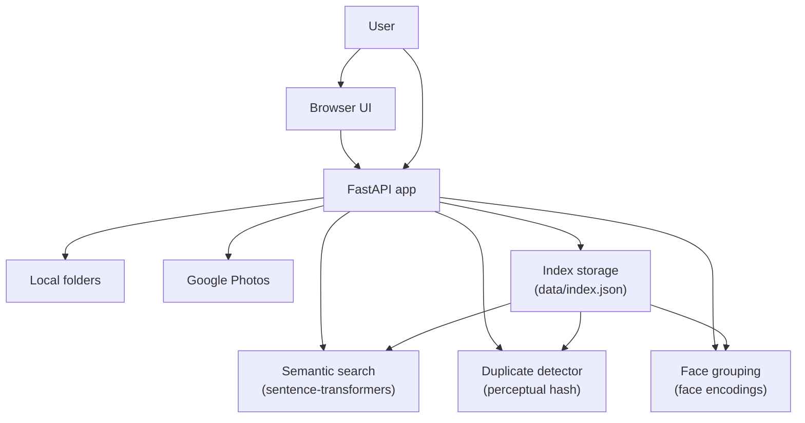

# Architecture

The AI Photo Manager is built as a modular FastAPI service with separate components for indexing, AI classification, duplicate detection, face grouping, and search.

## Architecture Diagram

## Components

- `app.main` – API entrypoint and endpoint definitions
- `app.services.indexer` – image scanning, index persistence, and orchestration
- `app.services.category` – category assignment using CLIP embeddings and filename heuristics
- `app.services.duplicates` – exact and near-duplicate grouping based on image perceptual hashes
- `app.services.face_grouping` – face detection and cluster assignment via face encodings
- `app.services/search` – semantic search using natural language embeddings
- `app.services.google_photos` – Google Photos connector and library synchronization

## Data Flow

1. Images are discovered from local directories or Google Photos.
2. Each image is converted to a record with metadata, categories, hashing, embeddings, and face encodings.
3. The index is stored in `data/index.json`.
4. Search queries compare user text embeddings against stored image embeddings.
5. Duplicate and face group endpoints derive clusters from the index.
